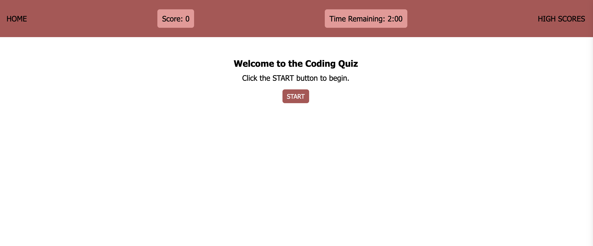
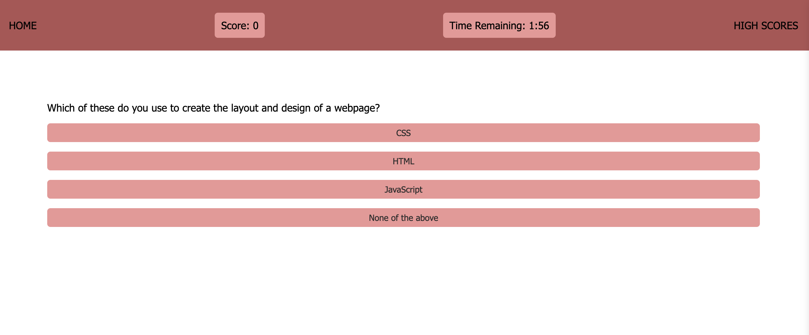

# coding-quiz
## User Story
```md
As a bootcamp student I want a fun way to study 
what I am learning in class in order to consistently refresh my knowledge.
```
## Acceptance Criteria
```md
The quiz instructions must be clear and accurate.
It have a time of two minutes that starts counting down when the quiz starts.
It must have a score tracker and increase or decrease based on right or wrong answers.
The user must be able to see and save their high score.
The scores must be displayed on a leaderboard page, scores and user listed highest to lowest.
```
## Preview



https://b-frazier.github.io/coding-quiz/